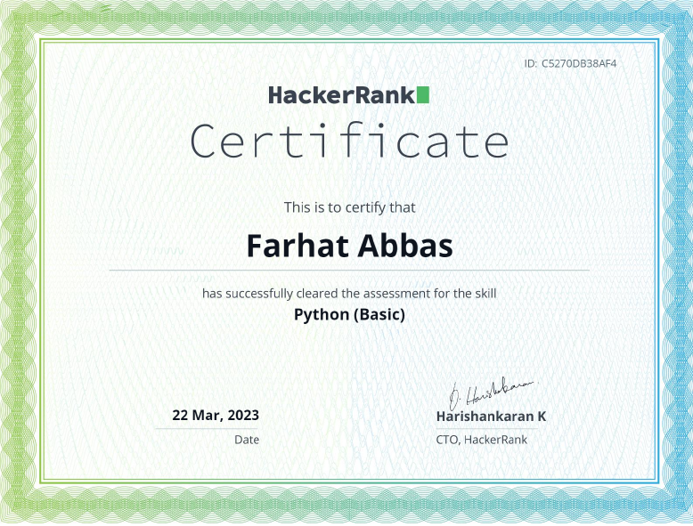
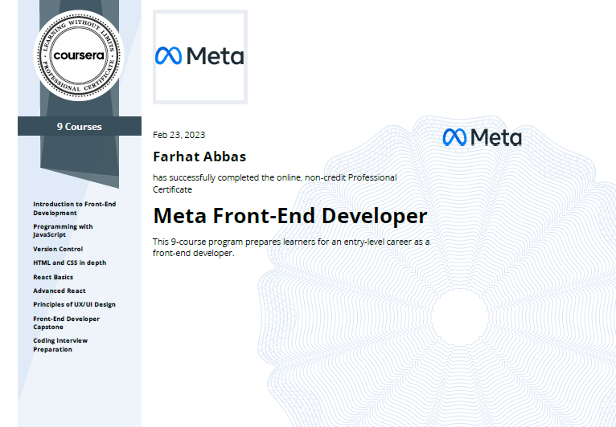

# Howdy, Farhat Here 👋🤠

## I’m a Full Stack Developer 

- 😎 I’m done with major learning, only focused on Projects now!
- 🦄 I’m looking to impress people with my work, starting with ofcourse my Github Profile.
- ⚽ 2023 Goals: Job || Freelancing || use HackerRank || new Friends.
- 🎓 Computer Science undergrad at Air University. (2020-2024)  

## Connect with me

&nbsp;&nbsp;

## Languages & Tools

 
 

# Highlights
Below are the Projects that I have made from scratch (no help, only used documentation, stackoverflow & previous code), did all the problem solving on my own so I could Proudly say that I made these.

## Angular
I learnt Angular this summer and I absolutely love it.
- [Ice Cream Web Store](https://github.com/xizzax/angular-ecommerce-website) [Collabed with my friend, Services, Lazy Loading, Stripe, Express server MVC structure, Angular CDK, Tailwind + DaisyUI, aesthetic, Animations]
- [Ice Cream Web Store deployment](https://xizzax.github.io/angular-ecommerce-website/)
- [Kanban Boards App](https://github.com/farhat-is-coding/board-app) [Angular CDK, Tailwind + DaisyUI, local storage]
- [Kanban Boards deployment](https://farhat-is-coding.github.io/board-app/)
- Next Knock (can't share because it has sensitive data but ill add the deployed link once the website is live) [Django + Angular, MapTiler's Maps, used httpClient to interact with backend]
- [Game Hunter](https://github.com/farhat-is-coding/game-hunter) [Used rawg.io API to fetch games data, used services, detailed routing]
- [Game Hunter deployment](https://farhat-is-coding.github.io/game-hunter/)
- [Zelda](https://github.com/farhat-is-coding/zelda)(incomplete, having issue with its api, there are no images)[three consistent themes, APIs, top-notch designing]

## Flutter
- [Nikes](https://github.com/farhat-is-coding/block_chain_app) [Stuff Used: Integrating Express Server with this App & Made UI Too, 1st paid flutter project, 14 screens]
- [Fleet Tracking](https://github.com/farhat-is-coding/fleet_tracking) [Stuff used: Google Maps, Firebase]
- [Notes & Todo](https://github.com/farhat-is-coding/notes_todo_app_firebase) [Stuff Used: Rive(animations), Firebase, Getx Framework]
- [SendLinks](https://github.com/farhat-is-coding/sendlinks-flutter) (Linktree Clone) [Stuff used: Firebase]
- [Comic Hub](https://github.com/farhat-is-coding/comic_hub) [Getx, APIs, collabed with friends]
- [Anime Database](https://github.com/farhat-is-coding/anime_database_flutter) (incomplete)[Apis, Firebase]
- E-Commerce Store (incomplete)

## Python
- [Marks D&C](https://github.com/farhat-is-coding/AI-DIP_Marks-DC) [Collabed with friend/ML/YOLO Model/OCR/Favorite Project I made in my Uni]
- [Hotel Management System](https://github.com/farhat-is-coding/Hotel-Management-Tkinter) (tkinter + SQLserver)
- Made 2 RESTful APIs in Django (cant share because of sensitive data, if you want to see, feel free to message me)

## Front-End
- [Aesthetic Dashboard](https://github.com/farhat-is-coding/aesthetic-dashboard)
- [Aesthetic Dashboard deployment]()
- [SendLinks](https://github.com/farhat-is-coding/send-links-react) (React + Firebase)
- Music Player (needs a rework)
- [Gojo Landing page](https://github.com/farhat-is-coding/gojo-webpage) [html css landing page, I made this in 2021]
- [Gojo Landing Page deployment](https://farhat-is-coding.github.io/gojo-webpage/)
- [Dynamic background](https://github.com/farhat-is-coding/background-swapper) [Also an old project, I made somewhere in 2021]
- [Dynamic background deployment](https://farhat-is-coding.github.io/background-swapper/)
  

